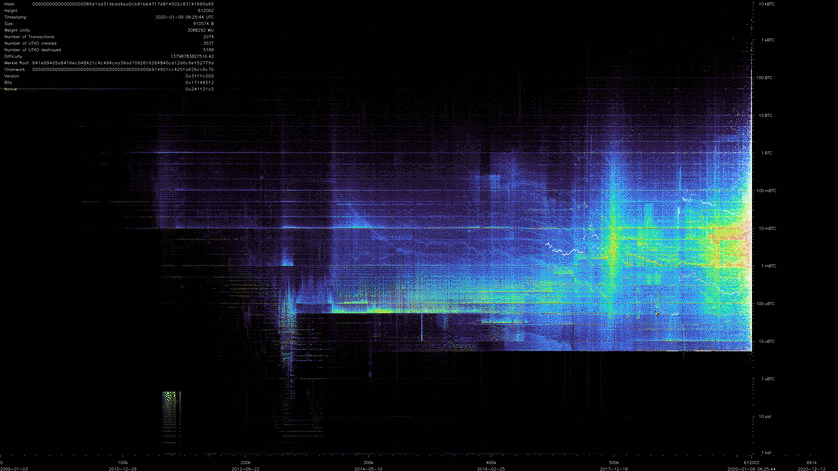

# BitcoinUtxoVisualizer

BitcoinUtxoVisualizer (short `buv`) can generated videos of the evolution of the evolution of Bitcoin's [UTXO (Unspent Transaction Outputs)](https://medium.com/bitbees/what-the-heck-is-utxo-ca68f2651819).

Watch the video on Youtube:

<!--
How to create this gif from the video:

ffmpeg -ss 02:50:00 -i Bitcoin\ UTXO\ evolution\ -\ Block\ 0\ to\ 661045.mp4 -c copy out.mp4
ffmpeg -i out.mp4 -frames:v 20 -vf "fps=10,scale=838:-1:flags=lanczos" -c:v pam -f image2pipe - |convert -delay 10 - -loop 0 -layers optimize output.gif

# compress more, see https://stackoverflow.com/a/47343340/48181
mogrify -layers 'optimize' -fuzz 7% output.gif
-->
[](https://www.youtube.com/watch?v=18m0bKsVb0Y)

# Installation

**WARNING**: Generating such video is a time & resource intensive task, as Bitcoin's database is continuously growing.

This currently only works in Linux. Prerequisites are a C++ compiler `g++` (>= v9) (or, my prefered choice, `clang++`), CMake (>= 3.13), and OpenCV (`libopencv-dev`).


1. fetch
   ```
   git clone --recurse-submodules https://github.com/martinus/BitcoinUtxoVisualizer.git
   ```
1. compile
   ```
   mkdir BitcoinUtxoVisualizer/build
   cd BitcoinUtxoVisualizer/build
   cmake -DCMAKE_BUILD_TYPE=Release ..
   make -j12
   ```
1. Run all tests, should print `SUCCESS!`
   ```
   ./buv
    ```


# How To Generate a UTXO Movie

This is a 3 step process:

## 1. Bitcoin Core

1. Have a fully synced [Bitcoin Core](https://bitcoin.org/en/bitcoin-core/) node running locally.
1. Make sure to enable transaction index by adding `txindex=1` to `bitcoin.conf`.
1. `buv` makes heavy use of Bitcoin Core's JSON RPC, so you need to enable this as well. Also, make sure the
   RPCs have enough threads for processing. To sum this up, I have these settings in my `bitcoin.conf` file:
   ```
   server=1
   rest=1
   rpcport=8332
   rpcthreads=32
   rpcworkqueue=64
   txindex=1
   dbcache=2000

   # generate username & password with 'bitcoin/share/rpcauth.py <username> -'
   rpcauth=martinus:xxxxxxxxxxxxxxxxxxxxxxxxxxxxxxxxxxxxxxxxxxxxxxxxxxxxxxxxx
   ```

## 2. Preprocess UTXO Data

Once Bitcoin Core is fully synced and RPC is enabled, you can preprocess the UTXO database. This fetches all blocks with full transaction data from bitcoin core, extracts UTXO data, and writes a compact data file. First, configure by editing `buv.json`. For this step, you only need to update `bitcoinRpcUrl` and the output `blkFile`:

```
"bitcoinRpcUrl": "http://127.0.0.1:8332",
"blkFile": "/run/media/martinus/big/bitcoin/BitcoinUtxoVisualizer/changes.blk1",
```

The output `blkFile` will be ~7.5GB large (as of Block 660,000). It contains block information & all satoshi amounts that were added or removed for each block. The format is tuned to be very compact and very fast to parse.

```
./buv -ns -tc=utxo_to_change -cfg=../buv.json
```

On my computer this takes about 1 1/2 hours, saturates 12 cores, and takes ~6.5GB of RAM. I have spent a long time to speed this up, initially this took 4 days and >30GB of RAM.


## 3. Generate UTXO Video

After generating the `blkFile`, this file can be converted into an image stream that is directly piped into `ffmpeg` to generates a video. Preview is possible with `ffplay`.

The configuration file `buv.json` has several options to configure the output.

### Generate Preview

To watch a preview, I usually update `buv.json` to start at a reasonably late block:
```
"startShowAtBlockHeight": 200000,
```

1. In one window, start `ffplay`:
   ```
   ffplay -f rawvideo -pixel_format rgb24 -video_size 3840x2160 -framerate 60 -i "tcp://127.0.0.1:12987?listen"
   ```

1. In another window, start `buv` to connect to `ffplay` and pipe its output into it.
   ```
   ./buv -ns -tc=visualizer -cfg=../buv.json
   ```
   Once `buv` has processed up to block 200000 ffplay will pop up and show a life preview.

If you are happy with what you see, instead of `ffplay` use `ffmpeg` and start `buv` again:

```
ffmpeg -f rawvideo -pixel_format rgb24 -video_size 3840x2160 -framerate 60 -i "tcp://127.0.0.1:12987?listen" -c:v libx264 -profile:v high -bf 2 -g 30 -preset slower -crf 24 -pix_fmt yuv420p -movflags faststart out.mp4
```

For 660000 this will create a ~3 hour 4K x 60Hz video, where each frame represents a single block. The video is about 21GB large.

Here is the final image of that video. Click for high resolution 4k image:

[](https://raw.githubusercontent.com/martinus/BitcoinUtxoVisualizer/master/doc/img_0661045_compressed.png)

